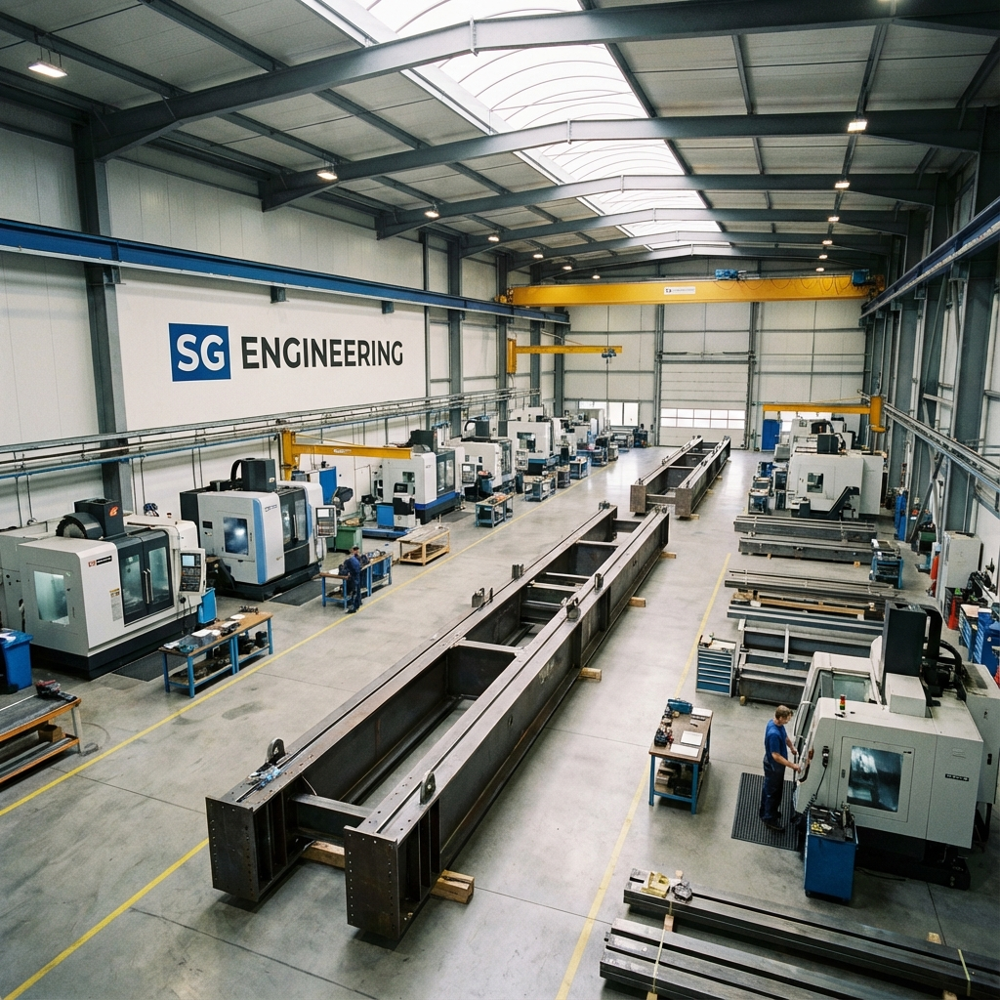

# SG Engineering 🏗️

Welcome to the official repository for **SG Engineering**, a premier provider of industrial lifting solutions. We specialize in the design, engineering, manufacturing, and supply of heavy-duty cranes, helping industries lift progress with trust and excellence.



## 🌐 Live Website
Visit our official website: [http://sgengineering.info](http://sgengineering.info)

## 🚀 About Us
Established with a vision to deliver world-class lifting solutions, SG Engineering stands as a trusted name in the crane industry. Our state-of-the-art manufacturing facility is located in MIDC Additional Ambernath, Maharashtra, spanning over 2000 Sq. Mtrs.

**Certifications:** ISO 9001:2015 CERTIFIED

### Our Leadership
- **Mr. Shyampyare Chauhan** - Founder & Industry Veteran (45+ years of experience)
- **Mr. Dinesh Choudhary** - Sr. Designer & Mechanical Engineer (Expert in cranes up to 100T capacity)
- **Mr. Abhishek Kumar** - Electrical Director

## 🛠️ Products & Services
We pride ourselves on manufacturing top-tier industrial cranes:
- **EOT Cranes** (Single & Double Girder)
- **Goliath / Gantry Cranes**
- **Jib Cranes**
- **Electric Wire Rope Hoists**
- **Custom Material Handling Solutions**

## 📁 Project Structure
The source code for our website is cleanly organized:
```text
.
├── assets/          # Images and graphical assets
├── css/             # Stylesheets (style.css)
├── js/              # JavaScript files (script.js)
├── index.html       # Home page
├── about.html       # About Us page
├── contact.html     # Contact page
├── products.html    # Products catalog
└── services.html    # Services detailed page
```

## 💻 Tech Stack
- **HTML5**: Semantic and accessible web structure.
- **Vanilla CSS3**: Custom, responsive styling without heavy frameworks.
- **Vanilla JavaScript**: Lightweight interactions and dynamic features.
- **FontAwesome**: Modern vector icons for UI enhancements.

## 📞 Contact Information
- **Address:** B106, Addl. MIDC Ambernath (E) 421501, Thane, MH
- **Phone:** +91-9730357525
- **Email:** sgengg2022@gmail.com

---
*Built in India, Lifting the World.* © 2025 SG ENGINEERING. All Rights Reserved.
